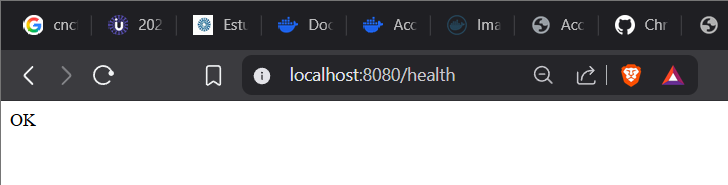
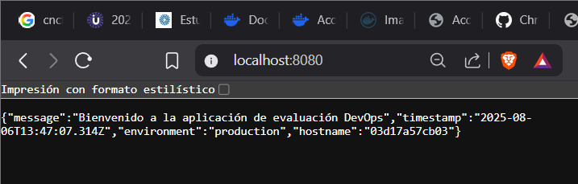
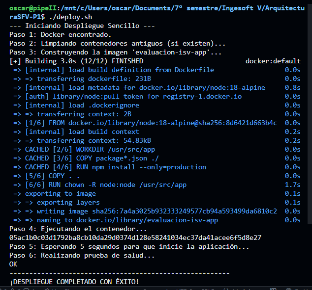

# ArquitecturaSFV-P1

# Evaluación Práctica - Ingeniería de Software V

## Información del Estudiante
- **Nombre:** Oscar Stiven Muñoz Ramirez
- **Código:** A00399922
- **Fecha:** 6 de agosto de 2025

## Resumen de la Solución
En la solucion implementada fue una pagina web simple con node.js que ha sido contenerizada por docker, para esto realizae un dokerfile optimizado para crear una imagen ligera de la app. Además, se creó un script de automatizacion en bash (deploy.sh) que maneja el ciclo de vida del despliegue:

1. Verifico los prerrequsitos
2. Limpio ejecucions pasadas si hay
3. Creo la imagen
4. Ejecuto la imagen
5. Realizo prueba de salid para verificar si funciona la app bien

El proposito de esto es demostrar de forma util, los principios de devops como la automatizacion, junto implementacion y contenerizacion. 

## Dockerfile
Se eligió node:18-alpine porque es una versión de Node.js muy ligera. Esto hace que la imagen final ocupe menos espacio, se descargue más rápido y sea más segura.

- (COPY package*.json ./ y RUN npm install)
Primero se instalan las dependencias (npm install) y después se copia el resto del código. Gracias a esto, si solo cambias el código de tu app.js, la reconstrucción de la imagen es casi instantánea.

- (USER node)
A partir de ahora, cualquier comando que se ejecute dentro de este contenedor no lo hará el 'administrador' (root), sino un usuario con menos permisos llamado node.

- Expose 8080
Le informo a Docker que la aplicación que está dentro de este contenedor tiene la intención de usar el puerto 8080 para comunicarse.

- CMD ["npm", "start"]
Este es el comando por defecto que se debe ejecutar tan pronto como el contenedor arranque

## Script de Automatización


set -e: Establece la regla principal: si un comando falla, todo el script se detiene inmediatamente.

1. Verificar Docker: Comprueba si Docker está instalado en la computadora. Si no lo está, muestra un error y se detiene.

if ! command -v docker &> /dev/null

2. Limpiar Contenedor Antiguo: Busca si ya existe un contenedor con el mismo nombre de una ejecución anterior. Si lo encuentra, lo detiene y lo elimina para empezar de cero.

docker stop evaluacion-isv-container > /dev/null 2>&1 || true
docker rm evaluacion-isv-container > /dev/null 2>&1 || true

3. Construir Imagen: Lee las instrucciones del archivo Dockerfile y construye la "imagen" de la aplicación, que es el paquete que contiene todo lo necesario para que funcione.

docker build -t evaluacion-isv-app .


4. Ejecutar Contenedor: Inicia la aplicación usando la imagen recién creada. Le dice que use el puerto 8080 y que se ejecute en modo production.

docker run -d -p 8080:8080 \ ... 

5. Esperar: Hace una pausa de 5 segundos para darle tiempo a la aplicación de arrancar completamente.

sleep 5


6. Probar Salud: Llama a una URL específica (/health) de la aplicación para confirmar que está activa y respondiendo correctamente.

curl --fail --silent http://localhost:8080/health


7.  Si todos los pasos anteriores se completaron sin errores, imprime un mensaje final diciendo que el despliegue fue exitoso y muestra la URL para acceder a la aplicación.

## Principios DevOps Aplicados
1. Automatización: En lugar de escribir muchos comandos a mano cada vez, creamos un único script (deploy.sh) que construye, ejecuta y prueba todo con una sola orden. Esto ahorra tiempo y evita errores
2. Infraestructura como Código: En lugar de configurar un servidor a mano, lo describimos en un archivo de código (Dockerfile). Esto garantiza que el entorno siempre se cree de la misma manera y sin errores.
3. Contenerización: La aplicación se mete en una caja que tiene todo lo que necesita. Esta caja funciona de forma idéntica en cualquier computadora, solucionando el problema de en mi máquina sí funciona.

## Captura de Pantalla



## Mejoras Futuras
1. Automatizar todo CI/CD en crear un sistema para que, al subir código a GitHub, la aplicación se pruebe y se despliegue sola.

2. Añadir más servicios fácil con Docker Compose para usar una herramienta para levantar la aplicación junto a otros servicios (como una base de datos) con un solo comando.

3. Vigilar la aplicación con monitorio en agregar herramientas para ver en tiempo real cómo funciona la aplicación (velocidad, memoria, etc.) y juntar todos sus mensajes en un solo lugar.
## Instrucciones para Ejecutar

Clona el repositorio y entra en la carpeta:

## 1. Clonar el repositorio y entrar en la carpeta

```bash
git clone https://github.com/OscarMURA/ArquitecturaSFV-P1
cd ArquitecturaSFV-P1
``` 

## Dar permisos al script (solo la primera vez)

``` 
chmod +x deploy.sh
``` 

## Ejecutar el script

``` 
./deploy.sh

``` 

##  Abrir la aplicación en el navegador

Abre http://localhost:8080 en tu navegador para ver la aplicación.


